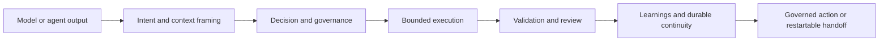

# AletheIA

**AletheIA** is an operating framework for AI-assisted work.

It adds an explicit layer between model output and execution so teams can work with:

- clearer framing
- bounded execution
- reviewable decisions
- proportional validation
- reusable learnings

In short:

`model or agent output -> AletheIA -> governed action`

---

## What AletheIA is

AletheIA is:

- provider-agnostic
- reusable across projects
- focused on bounded, reviewable work
- designed to preserve continuity across agents, runtimes, and handoffs

## What AletheIA is not

AletheIA is not:

- a chatbot
- a single-runtime wrapper
- a hidden auto-router
- a substitute for project-local operating rules

---

## How AletheIA works



The framework helps teams move from:

`prompt -> output -> execution`

into:

`intent -> context -> decision -> execution -> validation -> learning`

That shift is the core value of AletheIA.

---

## What makes AletheIA different

AletheIA is not only a workflow-control layer.
It also provides:

- **Governed decisions** — the framework can help decide when work should continue, slow down, escalate, or require review
- **Context and token discipline** — context expansion is treated as something to justify, not something to do by reflex
- **Runtime and trust-boundary awareness** — hosted vs local posture, runtime fit, and operational boundaries are part of the model
- **Restartable continuity** — handoffs, restart packages, and finalization are designed to survive runtime changes without transcript replay
- **Validation before closure** — proof is part of the work, not an optional afterthought
- **Learning from real work** — pilot evidence, failed validation, and repeated friction can become durable learnings instead of disappearing into chat history

---

## Core concepts

AletheIA keeps a stable core vocabulary so the framework does not get redefined by one tracker, one chat surface, or one runtime.

The most important concepts are:

- **Work Slice** — the bounded unit of operational work
- **Work Item** — the external coordination unit a slice may point to
- **Restart Package** — the compact continuity artifact used after a boundary
- **Handoff** — the transition artifact that carries work across a meaningful boundary
- **Execution Surface** — the local runtime where work happens
- **Agent Role** — the portable semantic responsibility of an agent boundary
- **Runtime Adapter** — the runtime-local mapping that preserves framework meaning

For the canonical definitions, start with:

- `docs/canonical-vocabulary.md`

---

## What is in this repository

The repository is organized around four practical blocks:

1. **framework core**
   - contracts, governance, token discipline, quality, learnings, examples, tests
2. **starter-pack**
   - reusable guides, templates, and practical operating materials
3. **pilot materials**
   - self-application, Crisis Monitor grounding, pilot conversion, project extension
4. **post-1.0 tracks**
   - constrained adoption, resource-aware operations, and later evolution paths

---

## Where to start

### If you want the fastest understanding path

Read in this order:

1. `docs/getting-started.md`
2. `docs/00-overview.md`
3. `docs/governance.md`
4. `docs/canonical-vocabulary.md`

### If you want practical operating guidance

Start with:

1. `starter-pack/README.md`
2. `starter-pack/guides/daily-operations.md`
3. `docs/apply-to-existing-project.md`

### If you want examples first

Start with:

1. `examples/hello-world/`
2. `examples/handoffs/compact-reviewable-handoff.md`
3. `examples/work-slices/standard-slice/README.md`

---

## Current status

AletheIA is now at **1.0.0**.

What 1.0 means:

- the Alpha 1–7 baseline is complete enough for public reuse
- the framework has a stable adoption path
- new work now belongs to **1.x evolution tracks**, not to unfinished baseline buildup

The two most relevant post-1.0 tracks today are:

- **1.1 constrained adoption / trust-boundary hardening**
- **1.2 resource-aware operations**

For the roadmap and release framing, see:

- `docs/roadmap-alpha.md`
- `docs/release-1.0-readiness.md`
- `docs/enterprise-readiness-roadmap.md`
- `docs/resource-aware-operations-roadmap.md`

---

## Practical reading paths

### Understand the framework

- `docs/getting-started.md`
- `docs/00-overview.md`
- `docs/governance.md`
- `docs/token-policy.md`
- `docs/durable-decisions.md`

### Adopt AletheIA in a real project

- `docs/apply-to-existing-project.md`
- `docs/project-extension-pattern.md`
- `docs/pilot-conversion.md`
- `starter-pack/README.md`

### Work with handoffs and continuity

- `docs/agent-handoffs.md`
- `starter-pack/guides/agent-handoff-generation.md`
- `starter-pack/templates/agent-handoff-template.md`
- `docs/slice-finalization-and-restart.md`

### Work with agent roles and runtime fit

- `docs/agent-roles-skills-runtime-adapters.md`
- `docs/agent-role-catalog.md`
- `docs/runtime-adapter-contract.md`
- `docs/agent-runtime-decision-guide.md`

### Inspect the Hermes pre-pilot guardrails

- `docs/adr/ADR-001-hermes-role.md`
- `docs/adr/ADR-002-memory-and-skill-promotion-policy.md`
- `docs/hermes/phase-minus-1-operational-matrix.md`
- `starter-pack/templates/hermes-closeout-template.md`
- `docs/hermes/manual-simulation-closeout.md`

---

## Design principles

1. Clarity over speed
2. Control over automation
3. Consistency over convenience
4. Reuse before duplication
5. Validation before closure
6. Learnings must stay reviewable

---

## Quick check

If you want one lightweight sanity pass after cloning:

```bash
bash scripts/check-governance.sh
```

---

## See also

- `docs/launch-kit.md`
- `CHANGELOG.md`
- `CONTRIBUTING.md`
